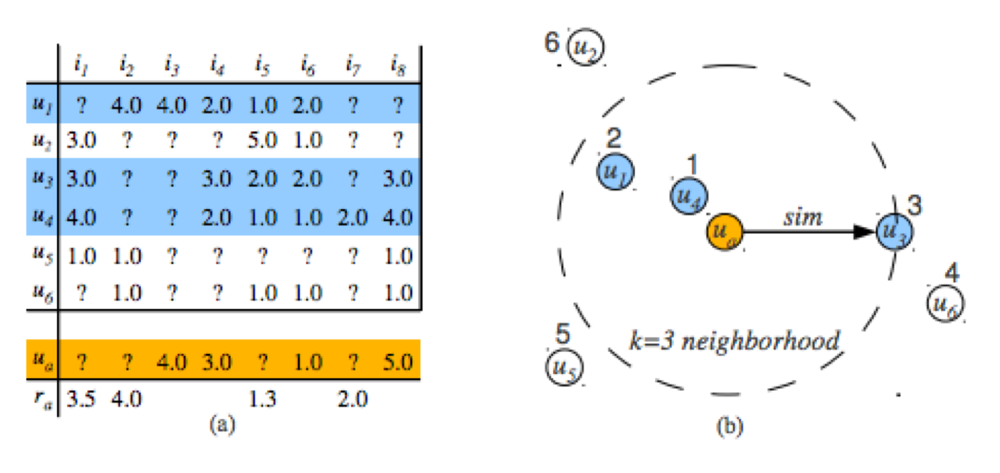
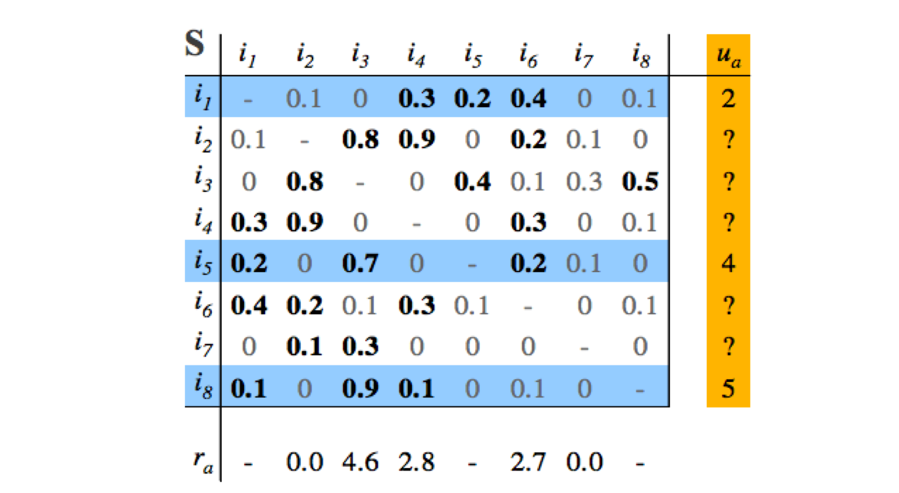
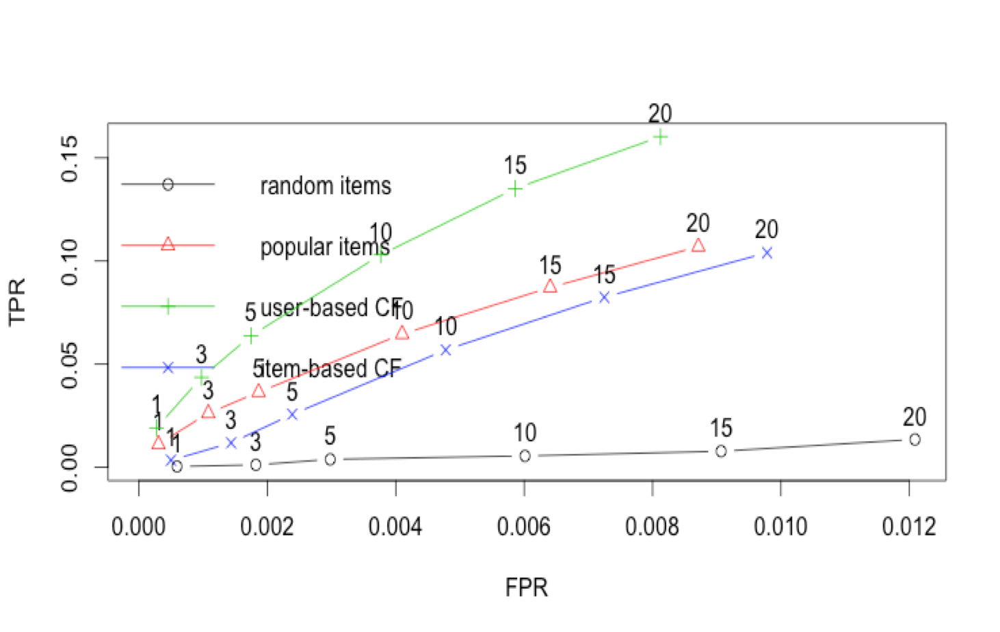

Introduction to Recommendations
=============================

## Collaborative Filtering

 * Collaborative Filtering (CF) is commonly used in “Recommended For You” or “More Like This” functionality
 * Recommendations can be explicit (based on user ratings), or implicit (based on user interest)
 * CF is expressed as Users -> Items However, any correlation could be modeled as users to items.
 * Users and Items could be the same (example: dating site)

### Ratings Matrix: Users/Items

### Item Ratings Matrix - Normalized

### Recommendations in Python

 * There is a specialized library called scikit-surprise for Recommendations
 * Has several ways of performing recommendations
   - SVD (Singular Value Decomposition)
   - ALS (approximation of SVD)
   - K-Nearest Neighbors

### Preparing Data for Scikit-surprise

 * Scikit-surprise only looks at integer userid and itemid.
 * Assign your data with unique integer userid and itemid.

 * Preferences are expressed as a double (higher is better)
   * What if your preferences are binary (yes/no)?
   * Assign a number, say, 5.0 for yes, and 1.0 for no.
   * What if preferences are just “implied”?
   * User viewed item as 5.0, no data for unviewed item.

 * Scikit-learn Rating: Integer, Integer, Double

### Evaluating CF Recommendations

### Examples

(Start these with Jupyter Notebook)

 * [1-surprise-movielens.ipynb](./1-surprise-movielens.ipynb)
 * [2-recs-audios.ipynb](./2-recs-audios.ipynb)

